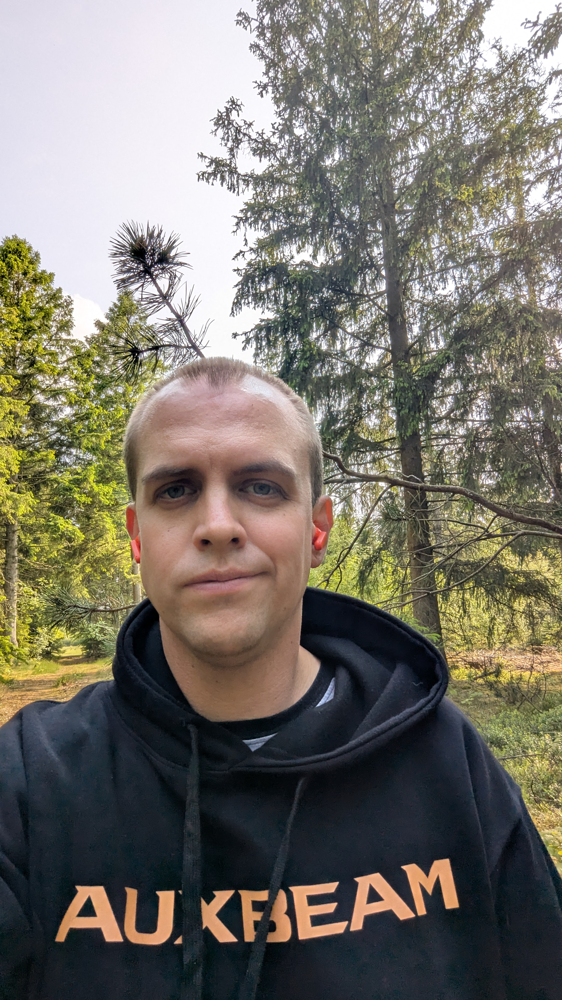

## 👋 Nice to see you here at my GitHub-page

IT-worker with previous experience in IT operations (server, DNS, payment gateways, WAF etc.) and sale of different as-a-service solutions (hosted Prestashop/Magento and Wordpress). Skilled in 1st, 2nd and 3rd level support and knows every corner of NodeJS.

- +20 modules coded (Magento, Prestashop or WooCommerce)
- Helped +100 eCommerce stores find their right place on the web
- Data driven IT problem solver
- Skilled in Google Ads, Google Search Console and Google Looker Studio (+ Certifications taken).
- Video and photo -editing (Photoshop, InDesign and Davinci Resolve)

- Active car products reviwer on YouTube (in Danish)
- Oh, and I love to make standard tasks become something that happens by itself in Power Automate when it makes sense...

Over 15 years of experience in eCommerce, specializing in both on-page and off-page SEO (including advanced link-building), Google Ads campaign optimization, and high-performance retargeting strategies across Google and social media platforms. Skilled in technical site optimization, Nordic market ranking strategies, and comprehensive digital growth solutions.

## Now something short in Danish...: Lykken tilsmiler den vågne 👋
